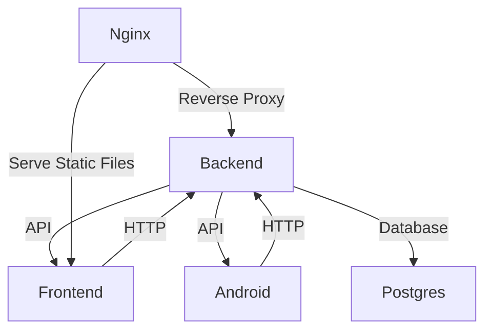

### Исходный код:

Мобилка:
https://gitlab.com/bossborisaushev/gitlab-mobile-copy/-/tree/master?ref_type=heads

Фронт:
https://gitlab.com/bossborisaushev/prod-final-frontend-copy/-/tree/master?ref_type=heads

Бэк:
https://gitlab.com/bossborisaushev/prod-finals-copy/-/tree/master?ref_type=heads

Пайплайн файлы в корневой директории

## Схема бд


## Логи CI/CD


Есть тесты по:
аналитике, авторизации и аутентификации,
редактированию профиля, создание запросов менторам,
работа с тегами.

## Покрытие тестами:

Процент не корректный из-за учета служебных и
скриптовых файлов(на самом деле выше)


Для админки:

### Логин:

```
admin
```

### Пароль:

```
1
```

## Схема проекта



## Swagger

### http://prod-team-34-rqpd9aim.REDACTED/api/swagger/

## Токен ментора:

```
REDACTED.eyJpZCI6NTUsImV4cCI6MTc0NDE1OTE0OH0.8nMhAiKfzPDolCRpH6l56jrjCQI3V1JUpG6AJp8WJVs
```

## Токен ученика:

```
REDACTED.eyJpZCI6MSwiZXhwIjoxNzQ0MTU5MjA4fQ.Mbv6wGljjsKOnP_0uC5lvbiR2OsbAQN4zboGDBAi_Ck
```

## Токен админа:

```
REDACTED.eyJpZCI6NTEsImV4cCI6MTc0NDE1ODk3NX0.-LY7chrBFic9zt3lvv7ueSKGb8-FXd7J5tZwhNfLxkw
```
